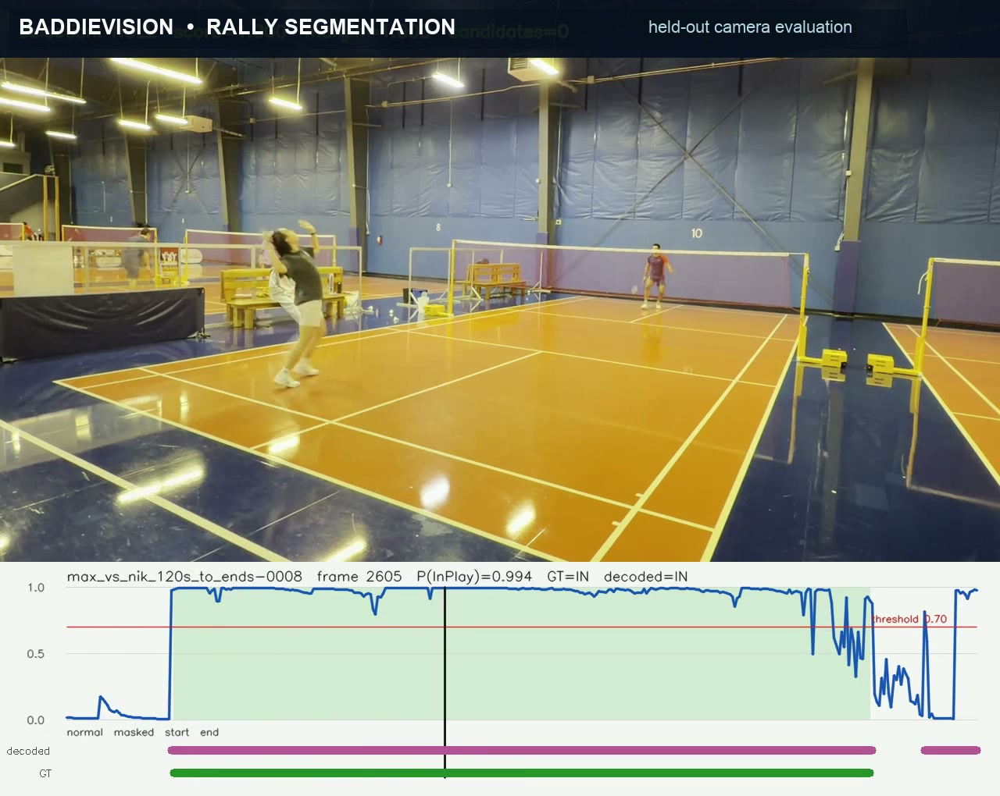

# BaddieVision

BaddieVision is a research project for turning static-camera badminton video
into structured match data. It combines player pose estimation, shuttle
tracking, court calibration, shot classification, and rally segmentation.



The maintained rally segmenter reached **0.718 macro frame F1** and **0.890
macro ROC-AUC** in leave-one-camera-group-out evaluation across four camera
groups (126 rallies and 52,012 labeled frames). These are research results on a
small private dataset, not a public benchmark. See the
[evaluation protocol and full metric summary](docs/independent-rally-segmenter.md#expanded-maintained-baseline).

The project includes:

- player pose extraction with MediaPipe;
- shuttle tracking with TrackNetV3 and YOLO;
- badminton-shot classification from pose and shuttle features;
- in-play/rally detection with frame-level and LSTM classifiers;
- metric court projection for static-camera footage.

This is an actively developed research prototype. Source videos, trained
weights, and generated features are not committed to the repository.

## Repository layout

```text
.
├── src/                         Main feature extraction and shot classifier
│   └── TrackNetV3/              Vendored TrackNetV3 implementation
├── InPlay/                      Rally/in-play labeling, training, and inference
├── yolov8/shuttle-yolo-dataset/ YOLO config plus the small curated dataset
├── notebooks/                   Research and data-preparation notebooks
├── requirements.txt             Runtime dependencies
└── requirements-dev.txt         Notebook and development dependencies
```

Large and generated assets stay on each development machine and are intentionally
ignored by Git. This includes videos, extracted clips/features, model weights,
checkpoints, inference output, and NumPy training arrays.

## Quick start

Python 3.11 is recommended because it has reliable wheel availability across the
computer-vision stack.

```bash
git clone --recurse-submodules https://github.com/MaxLinCode/BaddieVision.git
cd BaddieVision

python3.11 -m venv .venv
source .venv/bin/activate
python -m pip install --upgrade pip
python -m pip install -r requirements-dev.txt
python -m pytest -q
```

If `python3.11` is not available on macOS, install it first with Homebrew:

```bash
brew install python@3.11
```

PyTorch automatically uses CUDA where available. On Apple Silicon, training code
uses Apple's MPS backend when supported and otherwise falls back to CPU.

The single-video notebooks accept `.mp4` source videos only. Full inputs are
byte-copied into the portable result bundle when their frame rate is already at
or below the configured working FPS. Higher-frame-rate inputs use FFmpeg's FPS
filter, preferring fast NVIDIA NVENC encoding and falling back to ultrafast CPU
encoding. Trim-only operations use stream copy, so their boundaries are
keyframe-aligned and may not be frame-exact. No Python FFmpeg package is required.

Single-video result bundles retain the legacy selected `tracks.csv` path and also
include `shuttle_candidates.jsonl`, `shuttle_tracklets.jsonl`, and diagnostic
`shuttle_hypotheses.jsonl`. Candidates are
connected TrackNet components above the `0.5` threshold, not stored heatmaps;
InpaintNet continues to run only on the legacy single-track path. Tracklets are
conservative diagnostic fragments that can be regenerated from candidates
without rerunning TrackNet. Hypotheses are replayable top-five, diversified
whole-video associations of those fragments; they do not replace `tracks.csv`
or consume player evidence yet. Player previews show only the rank-1 path from
each association region as a magenta connected overlay, and older bundles may
omit the hypotheses artifact.

## Local data and models

After cloning onto another machine, copy or download your private working assets
into the same relative locations:

```text
videos/                         Source shot-classification videos
clips/                          Extracted/labeled shot clips
features/                       Generated pose and shuttle features
clip_features/                  Combined per-clip feature arrays
models/                         TorchScript models and classifier checkpoints
outputs/                        Rendered predictions and plots
InPlay/videos/                  Source rally videos
InPlay/features/                Generated rally pose/shuttle features
InPlay/data/                    LSTM training arrays
InPlay/models/                  In-play model checkpoints
src/TrackNetV3/ckpts/           TrackNetV3 checkpoints
```

The code now resolves these paths from the repository location, so the checkout
does not need to be named `badminton` or live directly under your home directory.

Portable ZIP bundles have been prepared under `data_packages/`. The ZIP files are
ignored by Git and can be uploaded to private cloud storage; their README and
SHA-256 files remain versioned. See
[`data_packages/README.md`](data_packages/README.md) for their contents and restore
instructions.

Do not commit the ZIP files to ordinary Git history. If you later want versioned
models or datasets, configure Git LFS or DVC before adding those files.

## Typical workflows

Extract pose features from videos:

```bash
python src/extract_features.py
mkdir -p features/court
cp config/court_calibrations.example.json features/court/calibrations.json
# Edit the registry and calibrate each static source video before continuing.
python src/extract_clip_features.py
```

Shot features include a normalized court-space player anchor. The extractor
resolves each clip to a shared source-video calibration through
`features/court/calibrations.json`. Modern clip names can contain a source ID
such as `img_3214`; clips without one need an explicit `clip_overrides` entry.
Calibration paths are relative to the registry:

```json
{
  "version": 1,
  "sources": {
    "img_3214": {"calibration": "img_3214.json"}
  },
  "clip_overrides": {
    "clear_001": "img_3214"
  }
}
```

Each source ID must identify one static camera segment. Create a new source and
calibration after any camera movement. Calibration files must include
`image_size`, which the calibration command records automatically. Missing or
ambiguous mappings and unusable foot tracks stop feature generation instead of
silently producing invalid training data.

Render the extracted pose, shuttle, and court-anchor features back onto a
source video:

```bash
python src/visualize_features.py videos/example.mp4 --max-frames 300
```

The renderer reads `features/pose/<base>_pose.json` and
`features/shuttle/<base>_ball.csv` by default, resolves court calibration from
`features/court/calibrations.json`, and writes
`outputs/<base>_feature_overlay.mp4`.

Train the shot classifier:

```bash
python src/train_shot_classifier.py
```

The generated feature shape is `(36, 76)`: 66 pose coordinates, 7 shuttle
features, and `[court_x, court_y, observed]`. Existing 73-input classifier
checkpoints must be retrained. Training now groups validation by source video,
so at least two calibrated sources are required and no recording appears in
both splits.

The singles player pipeline keeps detector output separate from court-role
interpretation. Raw extraction does not require calibration or MediaPipe:

```bash
python3 -m InPlay.heuristic.person_tracks extract \
  --video videos/example.mp4 --output outputs/example/person_tracks.jsonl
```

Interpret near-side P1 and far-side P2, incrementally enrich the pose cache,
and preserve the rally classifier's `players.csv` schema:

```bash
python3 -m InPlay.heuristic.player_visualizer \
  --video videos/example.mp4 \
  --person-tracks outputs/example/person_tracks.jsonl \
  --court-calibration features/court/example.json \
  --pose-cache outputs/example/pose_cache.jsonl \
  --assignments outputs/example/player_assignments.jsonl \
  --players-csv outputs/example/players.csv \
  --tracks-csv outputs/example/tracks.csv \
  --preview outputs/example/preview.mp4
```

The former `InPlay.heuristic.players` command remains as a deprecated
compatibility wrapper. Court calibration is required only for interpretation;
missing, ambiguous, or image-size-mismatched calibration is an explicit error.

The following feature-array workflow is retained for legacy reproduction, not
as the maintained data pipeline:

```bash
python InPlay/extract_features.py
python InPlay/extract_combined_features.py
python InPlay/train_lstm_model.py
```

The maintained joint experiment predicts strict rally state and publishes
shuttle selections only inside decoded rallies. After labeling fingerprinted
rally intervals and completing the refill queue documented in
[`docs/annotation-platform.md`](docs/annotation-platform.md), set
`dataset.rally_intervals_path` and `dataset.rally_manifest_path` in the selector
experiment config and run:

```bash
python3 -m src.temporal_selector.experiment \
  --config config/selector-experiment.local.json \
  --output-dir outputs/joint-selector-run \
  --context-mode full_context
```

For the matched `InPlay`-only ablation, keep the same config, seed, batch size,
device, and epoch count and add `--inplay-only`. This sets the shuttle-selection
loss weight to zero and removes all shuttle-candidate tokens during training,
per-epoch held-out evaluation, decoder calibration, and final inference. The
architecture, non-shuttle inputs, and folds remain unchanged:

```bash
python3 -m src.temporal_selector.experiment \
  --config config/selector-experiment.local.json \
  --output-dir outputs/inplay-only-ablation \
  --context-mode full_context --inplay-only
```

Joint runs also write `epoch_metrics.json` and
`epoch-inplay-diagnostics.png` with held-out per-epoch binary and boundary
diagnostics for every fold.

For the leakage-safe single-camera representation diagnostic, see
[`docs/within-camera-inplay.md`](docs/within-camera-inplay.md).

To test tapered boundary supervision without changing sampling, add for example
`--boundary-weight 3 --boundary-window-seconds 1`. The per-frame BCE multiplier
peaks at 3x at a true state transition, decays linearly to 1x over one second,
and is normalized by the total effective weight. A boundary weight of 1 is the
baseline behavior.

Joint runs write per-frame `rally_shuttle_predictions.jsonl` and strict
`rallies.csv`. Frames outside decoded rallies have shuttle outcome
`not_required`; clip padding remains an exporter concern.

Register maintained sources through the local workflow catalog. The catalog
contains only the local video and artifact root; readiness is always derived:

```bash
python3 -m src.workflow source add --video outputs/example/example_input.mp4 \
  --source-id example --artifact-root outputs/example
python3 -m src.workflow source doctor
python3 -m src.workflow stage import-calibration --source example \
  --from features/court/example.json
```

All source artifacts and annotations use source-local frames from zero through
`frame_count - 1`. Calibration is discovered only at
`ARTIFACT_ROOT/court/calibration.json`. The `features/court/calibrations.json`
registry remains relevant only to the separate shot-classifier clip workflow.

Train the YOLO shuttle detector:

```bash
python yolov8/shuttle-yolo-dataset/train_yolo.py
```

TrackNetV3 is included as a submodule pointing to the
[`MaxLinCode/TrackNetV3`](https://github.com/MaxLinCode/TrackNetV3) fork and its
`codex/badminton-integration` branch. The fork contains this project's custom
batch-prediction helpers and CUDA/MPS/CPU device support.

TrackNetV3 checkpoints are not included. See
[`src/TrackNetV3/README.md`](src/TrackNetV3/README.md) for the upstream checkpoint
download and its detailed training/inference instructions.

## Court projection

Calibrate a static camera with draggable court-line guides. The browser workflow
also works in headless WSL environments without OpenCV's Qt/X11 window support:

```bash
python src/calibrate_court.py videos/example.mp4 \
  features/court/example.json --frame 0 \
  --preview outputs/example_court_overlay.jpg
```

The command prints a localhost URL; paste it into a browser. Add
`--open-browser` only if WSL supports launching your host browser. The browser
has previous/next, ±10, and direct frame-number controls; changing frames clears
the calibration. Zoom with the mouse wheel or the Zoom ± buttons, pan with the
scrollbars, and use Fit to restore the full-frame view. A crosshair magnifier
follows the pointer.

For each cyan guide named in the header, click two points along the corresponding
painted court line. After four guides are placed, the full projected court
appears in green. Drag the orange handles until the green model aligns with the
video. Guide intersections may lie outside the frame, so cropped outer corners
are supported.

The defaults use the left and right doubles sidelines plus the near and far
short-service lines. Choose other visible floor markings with `--court-lines`:

```bash
python src/calibrate_court.py videos/example.mp4 features/court/example.json \
  --frame 120 --preview outputs/example_court_overlay.jpg \
  --court-lines left_singles_sideline right_singles_sideline \
                near_doubles_long_service far_short_service
```

At least two longitudinal and two cross-court lines are required. Extra visible
lines improve robustness. The older intersection-click workflow remains
available with `--mode points`. The saved homography maps image pixels to court
coordinates in metres, with the origin at court centre, x running left-to-right,
and y running near-to-far.

```python
from src.court_projection import CourtHomography

calibration = CourtHomography.load("features/court/example.json")
feet_xy_metres = calibration.project_to_court([[player_foot_x, player_foot_y]])
# MediaPipe coordinates are normalized, so also pass the source image size:
feet_xy_metres = calibration.project_normalized_to_court(
    [[landmark.x, landmark.y]], (frame_width, frame_height)
)
```

A planar homography is valid for points on the floor (player foot positions and
shuttle landing/contact points). Projecting an airborne shuttle gives only its
vertical image-ray intersection with the court plane, not its true 3D position.

## Contributing

Issues and focused pull requests are welcome. Before submitting a change, run:

```bash
python -m pytest -q
```

## License

This project is available under the [MIT License](LICENSE). The TrackNetV3
submodule retains its own license.
